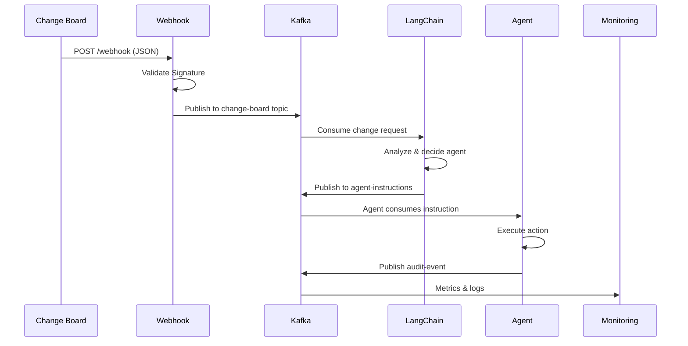
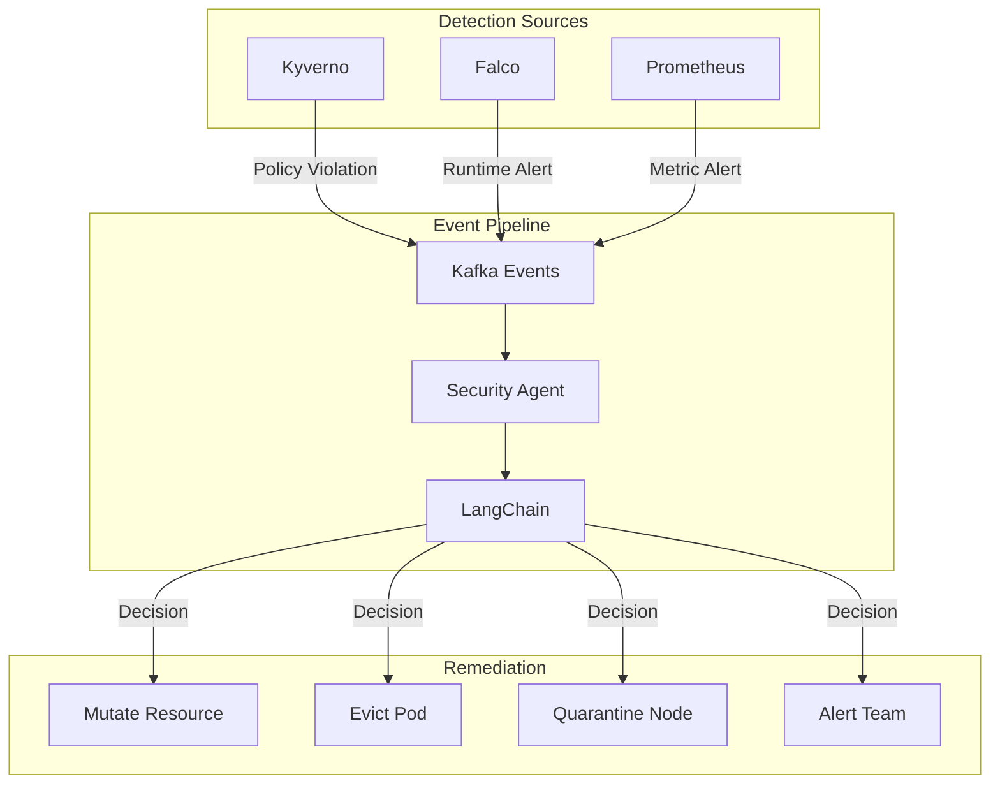
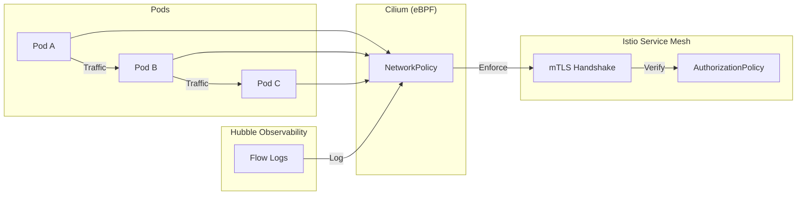
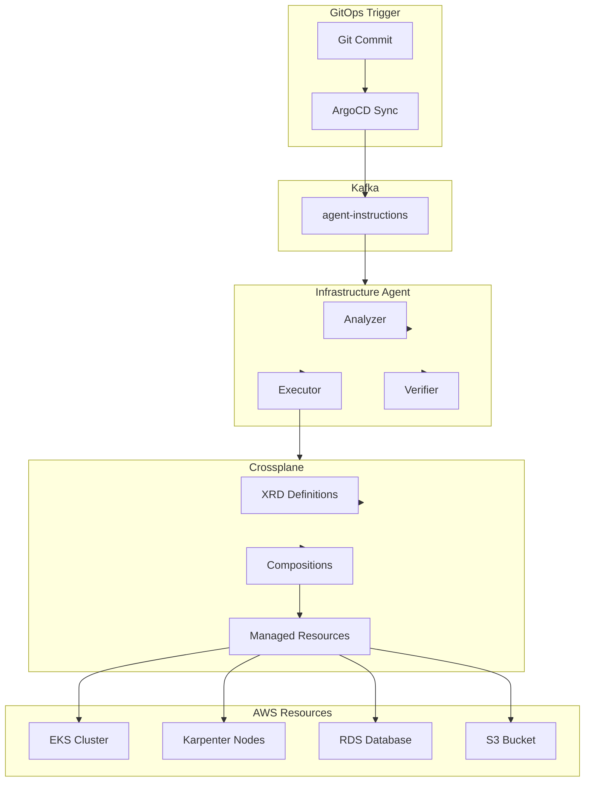
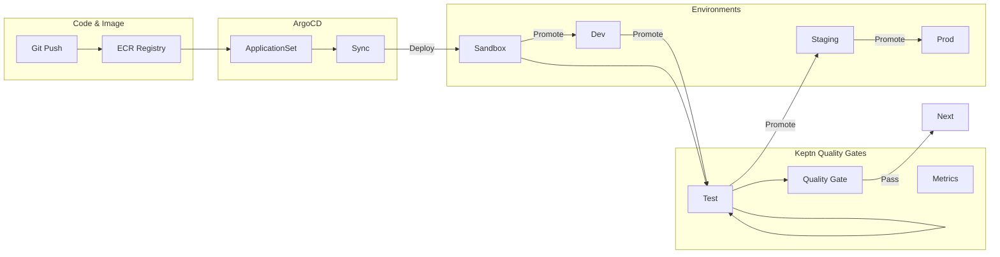
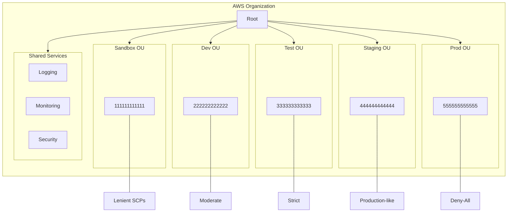
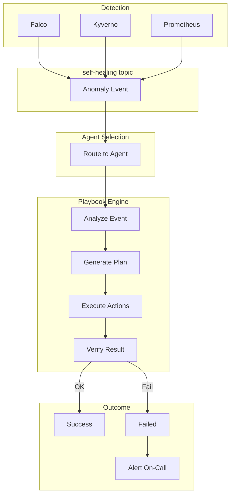
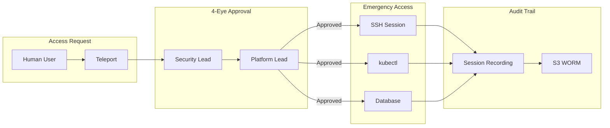
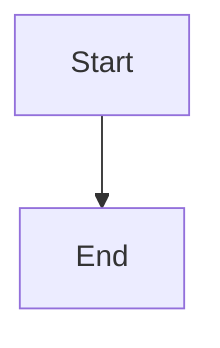

# Mermaid Diagrams for AWS Control Tower

This file contains Mermaid diagram definitions that can be rendered in Mintlify or any Mermaid-compatible Markdown viewer.

---

## 1. Overall Architecture

```mermaid
flowchart TD
    subgraph ChangeBoard["Change Board"]
        Jira[Jira/ServiceNow]
    end

    subgraph ControlTower["Control Tower"]
        Webhook[Webhook Endpoint]
        Kafka[Strimzi Kafka]
        LangChain[LangChain Orchestration]
    end

    subgraph Agents["5 Autonomous Agents"]
        Sec[Security Agent]
        Net[Network Agent]
        Infra[Infrastructure Agent]
        Apps[Applications Agent]
        Mem[Member Agent]
    end

    subgraph Environments["Environments"]
        Sandbox[Sandbox]
        Dev[Dev]
        Test[Test]
        Staging[Staging]
        Prod[Prod]
    end

    subgraph Monitoring["Monitoring Tower (Read-Only)"]
        Grafana[Grafana]
        Prometheus[Prometheus]
    end

    Jira -->|JSON Payload| Webhook
    Webhook -->|Validate| Kafka
    Kafka --> LangChain
    LangChain -->|Instructions| Sec
    LangChain -->|Instructions| Net
    LangChain -->|Instructions| Infra
    LangChain -->|Instructions| Apps
    LangChain -->|Instructions| Mem

    Sec --> Sandbox & Dev & Test & Staging & Prod
    Net --> Sandbox & Dev & Test & Staging & Prod
    Infra --> Sandbox & Dev & Test & Staging & Prod
    Apps --> Sandbox & Dev & Test & Staging & Prod
    Mem --> Sandbox & Dev & Test & Staging & Prod

    Sandbox & Dev & Test & Staging & Prod -->|Metrics/Logs| Monitoring
    Monitoring --> Graf## 2. Foundation Layer Flow

```mermaid
flowchart LR
    subgraphana
```

---

 Git["GitHub"]
        PR[PR Merged]
    end

    subgraph Actions["GitHub Actions"]
        Tofu[OpenTofu Apply]
    end

    subgraph AWS["AWS Resources"]
        OIDC[OIDC Provider]
        IRSA[5 IRSA Roles]
        SCPs[SCPs]
    end

    subgraph K8s["Kubernetes"]
        ArgoCD[ArgoCD Bootstrap]
    end

    PR --> Tofu
    Tofu -->|Creates| OIDC
    Tofu -->|Creates| IRSA
    Tofu -->|Applies| SCPs
    Tofu -->|Installs| ArgoCD
```

---

## 3. Control Tower Data Flow



---

## 4. Security Agent Pipeline



---

## 5. Network Agent - Zero Trust



---

## 6. Infrastructure Provisioning



---

## 7. Application Deployment Pipeline



---

## 8. Environments Isolation



---

## 9. Playbook Execution Flow



---

## 10. Governance - Break Glass



---

## Usage in Markdown

To use these diagrams, simply include them in your Markdown files:

````markdown

````

**Note:** Mintlify supports Mermaid diagrams natively. No additional configuration required.
